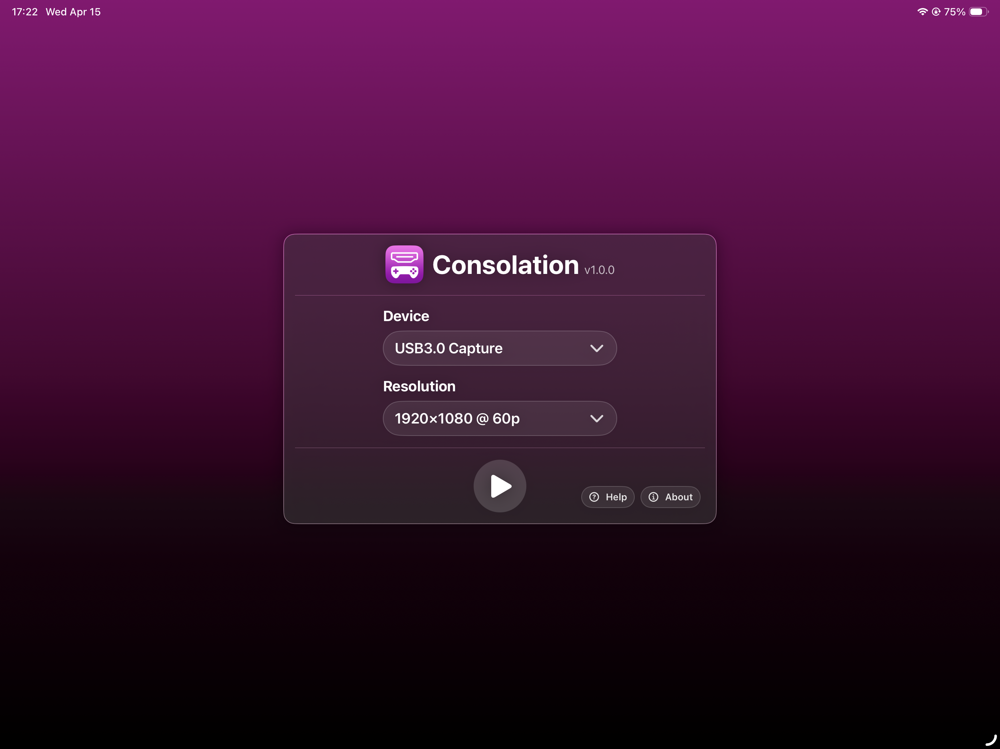
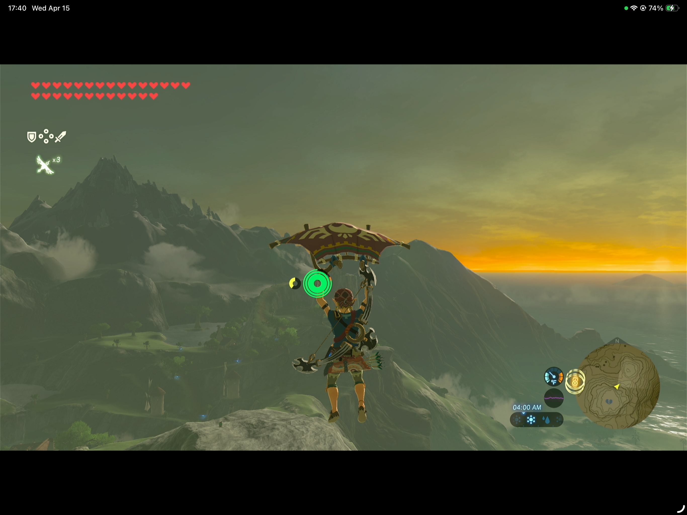
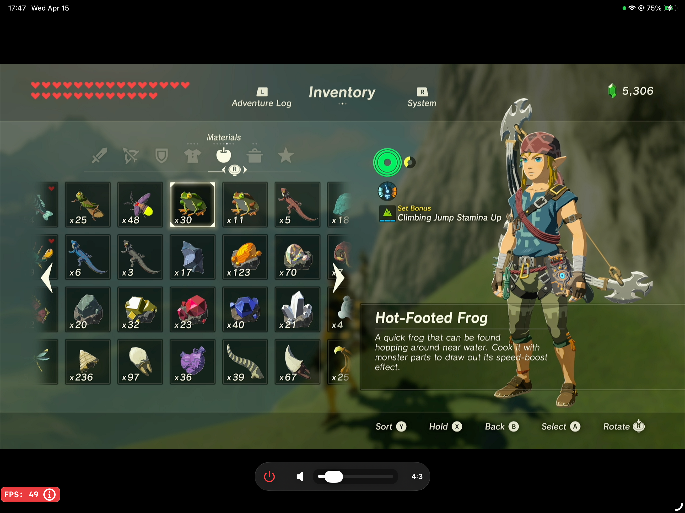
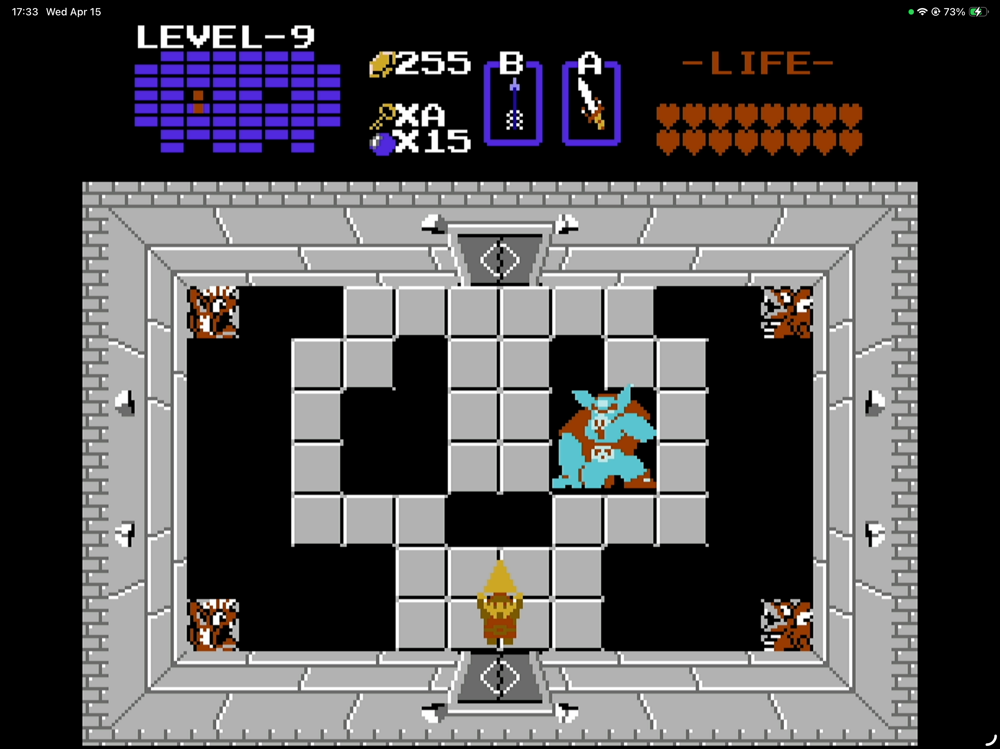
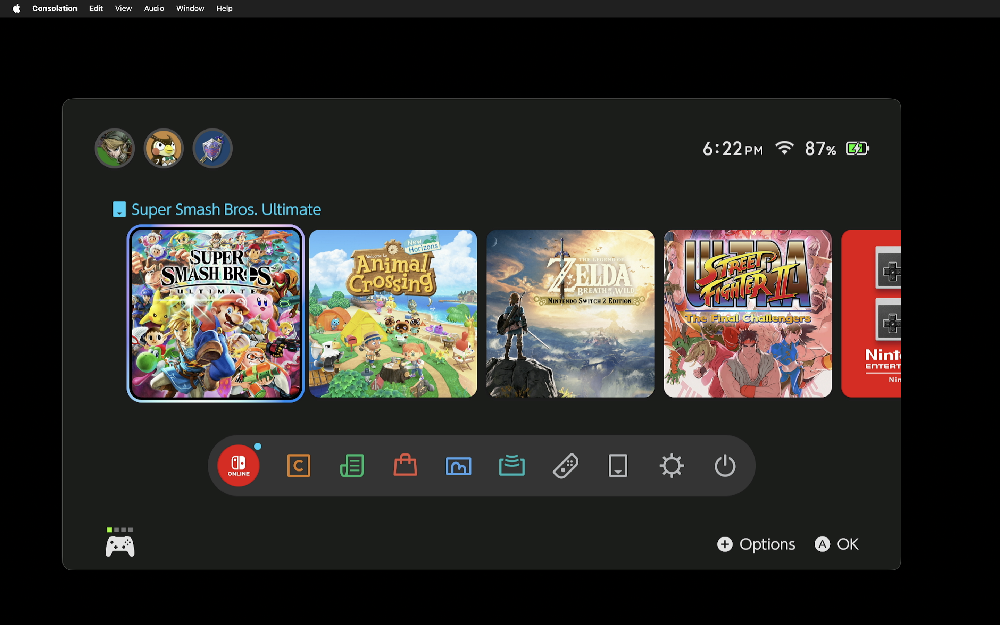
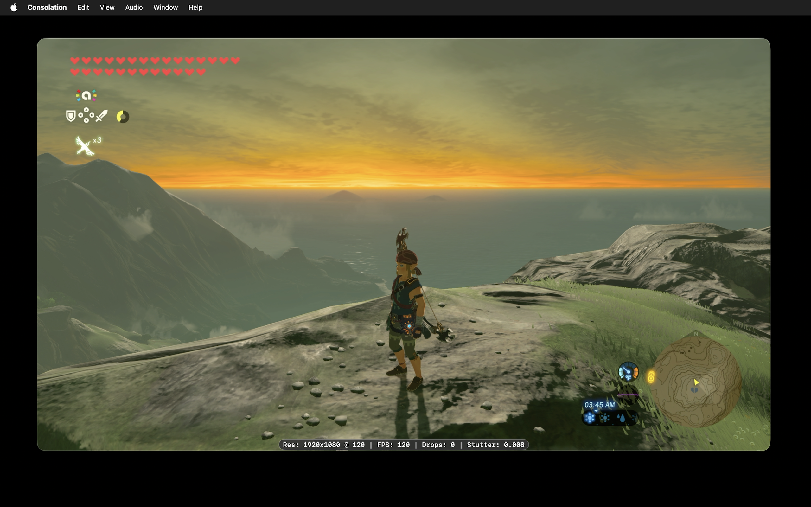
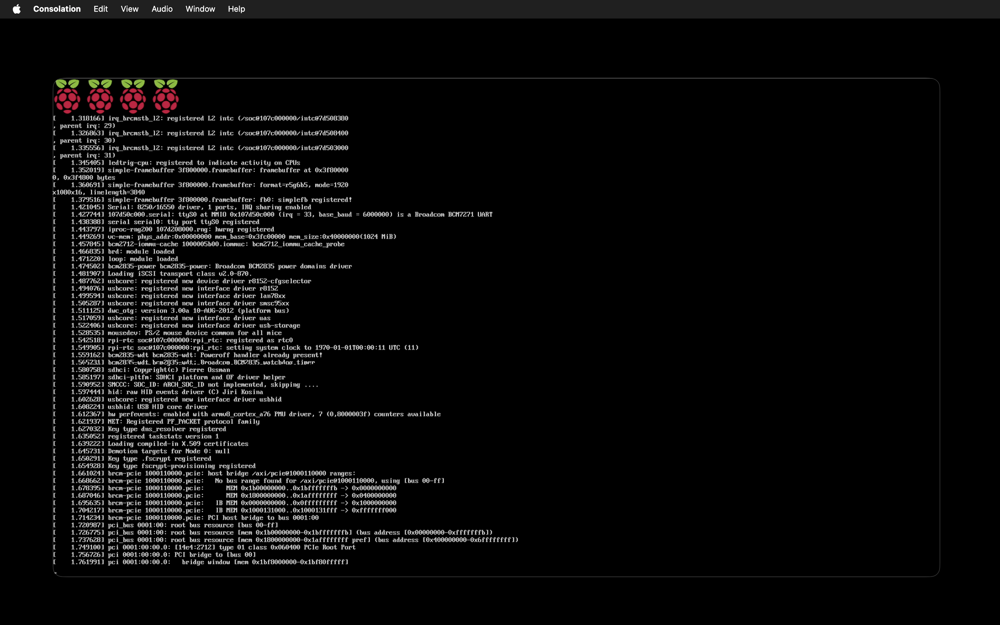

#  Consolation™ 

A no-frills video capture viewer for macOS and iPadOS.

Consolation is [available in the App Store](https://apps.apple.com/us/app/consolation/id1563856788) or can be downloaded directly from [this project's releases](https://github.com/centennial-oss/consolation/releases).

## About

Consolation is a free app that enables your Mac or iPad to be used as a screen for devices like gaming consoles, Raspberry Pis, and even a Mac mini, via a standard USB Video Class (UVC) video capture card.

The app is intentionally simple: watch the live video in a window or full screen. No recording or saving, no streaming to the internet. Just plug and play, privately with no ads or tracking.

## Screenshots

  

  

  

## Privacy

Consolation does not collect, send, or share your data. Audio and video stay local and transient while you are watching a connected capture device. The app is open source, contains no trackers or analytics, makes no network calls, and does not record, stream, save, or analyze audio or video. Nothing leaves your device - ever.

## Supported Capture Devices

Any capture device that appears to the system through AVFoundation as a USB Video Class (UVC) capture devices should work with Consolation.

Consolation has been tested by the developers with these capture devices:

- acer USB 3.0 Video Capture Card (model OCB5B0)
- WANKEDA 4K Capture Card 1080p 60FPS for Streaming (1da603d4)
- Elgato HD60 X
- UGREEN Full HD 1080p Capture Card (model 40189) -  ⚠️ max 30p @ 1920x1080

## Requirements

### Running

- Apple Silicon device with a USB port
- macOS 15 or higher
- iPadOS 18 or higher
- A UVC-compliant video capture card

### Developer

- Xcode 26.4 or higher, including Command Line Tools

## Building

1. Open `Consolation.xcodeproj` in Xcode.
2. Build and run.

## Tech Stack

- SwiftUI
- AVFoundation
- AppKit
- UIKit

## Contributor Disclosure

Humans write this software with AI assistance. All contributions are well-tested and merged only after being reviewed and approved by humans who fully understand and take responsibility for the contribution.

While we welcome pull requests and other contributions from other humans, including AI-generated code, we do not accept contributions from AI bots. A human must review, understand, and sign off on all commits. Please file an issue to discuss any proposed feature before working on it.

## Trademark Notice

Consolation and its logo are trademarks of Centennial OSS Inc.
Use of the name and branding is not permitted for modified versions or forks without permission.
See TRADEMARKS.md for details.
